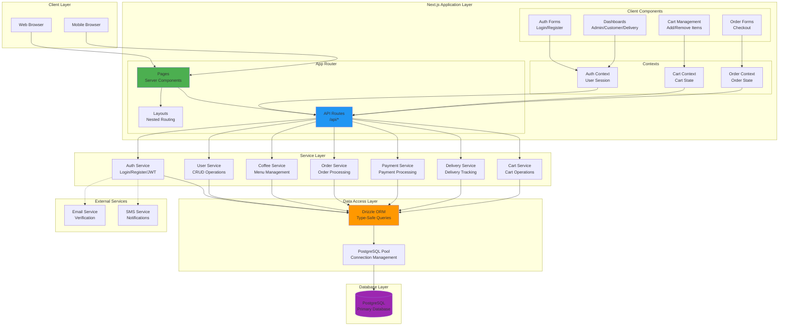
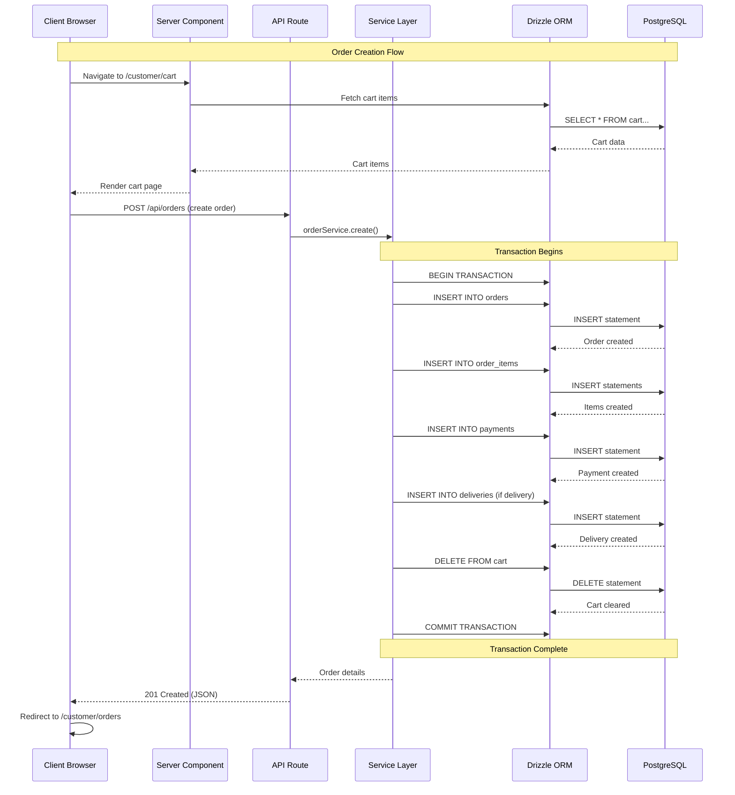
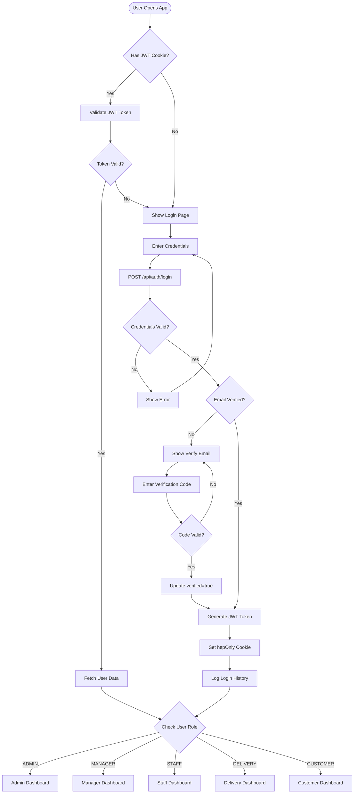
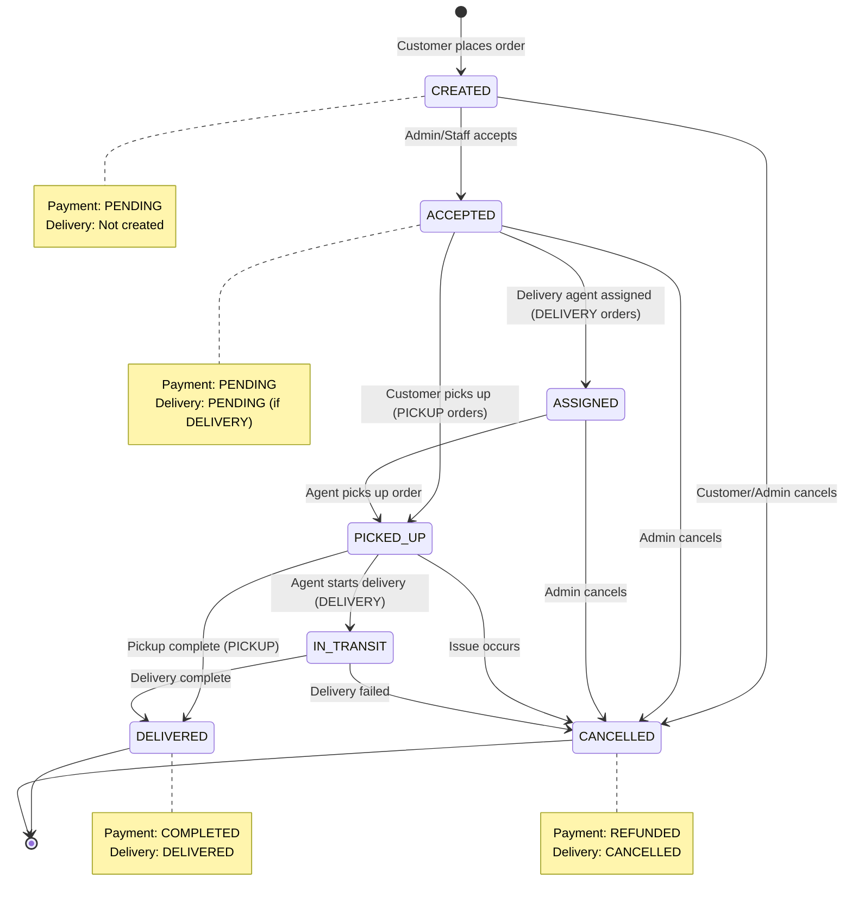
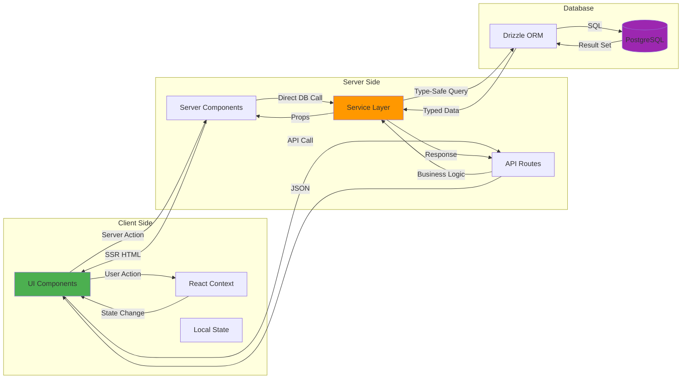
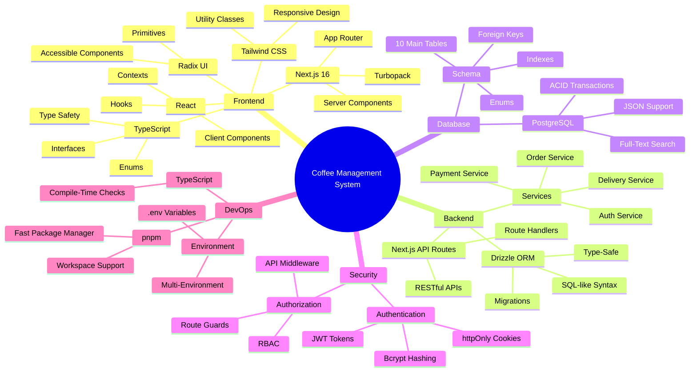

# Coffee Management System - Application Architecture

## System Architecture Diagram



## Request Flow Diagram



## Authentication Flow



## Order Processing State Machine



## Component Hierarchy

```mermaid
graph TD
    RootLayout[Root Layout<br/>app/layout.tsx]

    RootLayout --> AuthLayout[Auth Layout<br/>app/auth/layout.tsx]
    RootLayout --> DashLayout[Dashboard Layout<br/>app/dashboard/layout.tsx]

    AuthLayout --> Login[Login Page<br/>app/auth/login/page.tsx]
    AuthLayout --> Register[Register Page<br/>app/auth/register/page.tsx]

    DashLayout --> AdminLayout[Admin Layout<br/>app/admin/layout.tsx]
    DashLayout --> CustomerLayout[Customer Layout<br/>app/customer/layout.tsx]
    DashLayout --> DeliveryLayout[Delivery Layout<br/>app/delivery/layout.tsx]

    AdminLayout --> AdminDash[Admin Dashboard<br/>app/admin/page.tsx]
    AdminLayout --> AdminUsers[User Management<br/>app/admin/users/page.tsx]
    AdminLayout --> AdminMenu[Menu Management<br/>app/admin/menu/page.tsx]
    AdminLayout --> AdminOrders[Order Management<br/>app/admin/orders/page.tsx]
    AdminLayout --> AdminPayments[Payment Tracking<br/>app/admin/payments/page.tsx]
    AdminLayout --> AdminDeliveries[Delivery Management<br/>app/admin/deliveries/page.tsx]

    CustomerLayout --> CustomerDash[Customer Dashboard<br/>app/customer/page.tsx]
    CustomerLayout --> CustomerMenu[Browse Menu<br/>app/customer/menu/page.tsx]
    CustomerLayout --> CustomerCart[Shopping Cart<br/>app/customer/cart/page.tsx]
    CustomerLayout --> CustomerOrders[Order History<br/>app/customer/orders/page.tsx]

    DeliveryLayout --> DeliveryDash[Delivery Dashboard<br/>app/delivery/page.tsx]
    DeliveryLayout --> DeliveryActive[Active Deliveries<br/>app/delivery/active/page.tsx]

    Login --> LoginForm[LoginForm Component]
    Register --> RegisterForm[RegisterForm Component]

    AdminOrders --> OrderTable[OrderTable Component]
    CustomerCart --> CartItem[CartItem Component]
    CustomerMenu --> CoffeeCard[CoffeeCard Component]

    style RootLayout fill:#4CAF50
    style AuthLayout fill:#2196F3
    style DashLayout fill:#FF9800
    style AdminLayout fill:#F44336
    style CustomerLayout fill:#9C27B0
    style DeliveryLayout fill:#00BCD4
```



## Data Flow Architecture



## Technology Stack



## Folder Structure

```
coffee-management-system/
├── app/                                # Next.js App Router
│   ├── (auth)/                        # Auth group routes
│   │   ├── login/                     # Login page
│   │   └── register/                  # Register page
│   ├── (dashboard)/                   # Dashboard group routes
│   │   ├── admin/                     # Admin dashboard
│   │   │   ├── users/                 # User management
│   │   │   ├── menu/                  # Menu management
│   │   │   ├── orders/                # Order management
│   │   │   ├── payments/              # Payment tracking
│   │   │   └── deliveries/            # Delivery management
│   │   ├── customer/                  # Customer dashboard
│   │   │   ├── menu/                  # Browse menu
│   │   │   ├── cart/                  # Shopping cart
│   │   │   └── orders/                # Order history
│   │   └── delivery/                  # Delivery dashboard
│   ├── api/                           # API routes
│   │   ├── auth/                      # Auth endpoints
│   │   ├── coffees/                   # Coffee endpoints
│   │   ├── orders/                    # Order endpoints
│   │   ├── payments/                  # Payment endpoints
│   │   └── deliveries/                # Delivery endpoints
│   └── layout.tsx                     # Root layout
│
├── src/
│   ├── backend/
│   │   ├── database/
│   │   │   ├── schema/                # Database schemas
│   │   │   │   ├── auth.schema.ts
│   │   │   │   ├── order.schema.ts
│   │   │   │   ├── coffee.schema.ts
│   │   │   │   └── ...
│   │   │   ├── client.ts              # DB connection
│   │   │   ├── enums.ts               # Enum definitions
│   │   │   └── seed.ts                # Seed script
│   │   └── services/                  # Business logic
│   │       ├── auth.service.ts
│   │       ├── order.service.ts
│   │       ├── payment.service.ts
│   │       └── ...
│   │
│   ├── components/
│   │   └── ui/                        # Reusable UI components
│   │
│   ├── contexts/                      # React contexts
│   │   ├── auth-context.tsx
│   │   ├── cart-context.tsx
│   │   └── order-context.tsx
│   │
│   ├── lib/                           # Utilities
│   │   └── utils.ts
│   │
│   └── types/                         # TypeScript types
│       └── index.ts
│
├── docs/                              # Documentation
│   ├── DATABASE_SCHEMA.md
│   └── ARCHITECTURE.md
│
├── .env.example                       # Environment template
├── drizzle.config.ts                  # Drizzle configuration
├── tsconfig.json                      # TypeScript config
└── package.json                       # Dependencies
```

## API Endpoints Overview

### Authentication
- `POST /api/auth/register` - Register new user
- `POST /api/auth/login` - Login user
- `POST /api/auth/logout` - Logout user
- `GET /api/auth/me` - Get current user
- `POST /api/auth/verify-email` - Verify email
- `POST /api/auth/forgot-password` - Request password reset
- `POST /api/auth/reset-password` - Reset password

### Coffee Menu
- `GET /api/coffees` - List all coffees
- `GET /api/coffees/:id` - Get coffee details
- `POST /api/coffees` - Create coffee (Admin)
- `PUT /api/coffees/:id` - Update coffee (Admin)
- `DELETE /api/coffees/:id` - Delete coffee (Admin)

### Orders
- `GET /api/orders` - List orders (filtered by role)
- `GET /api/orders/:id` - Get order details
- `POST /api/orders` - Create order
- `PUT /api/orders/:id` - Update order status
- `DELETE /api/orders/:id` - Cancel order

### Cart
- `GET /api/cart` - Get user's cart
- `POST /api/cart` - Add item to cart
- `PUT /api/cart/:id` - Update cart item
- `DELETE /api/cart/:id` - Remove item from cart

### Payments
- `GET /api/payments` - List payments
- `GET /api/payments/:id` - Get payment details
- `POST /api/payments` - Process payment
- `PUT /api/payments/:id` - Update payment status

### Deliveries
- `GET /api/deliveries` - List deliveries
- `GET /api/deliveries/:id` - Get delivery details
- `PUT /api/deliveries/:id` - Update delivery status

### Admin
- `GET /api/admin/users` - List all users
- `POST /api/admin/users` - Create user
- `PUT /api/admin/users/:id` - Update user
- `DELETE /api/admin/users/:id` - Delete user
- `GET /api/admin/analytics` - Get system analytics
- `GET /api/admin/stats` - Get dashboard stats

## Security Measures

1. **Authentication**
   - JWT tokens with 7-day expiry
   - httpOnly cookies (XSS protection)
   - Bcrypt password hashing (10 rounds)
   - Email verification required

2. **Authorization**
   - Role-based access control (RBAC)
   - Middleware protection on API routes
   - Server-side session validation
   - Route guards for pages

3. **Data Protection**
   - SQL injection prevention (Drizzle ORM)
   - Input validation (Zod schemas)
   - CORS configuration
   - Environment variable security

4. **Database Security**
   - Connection pooling
   - Prepared statements
   - Foreign key constraints
   - Cascade delete protection
