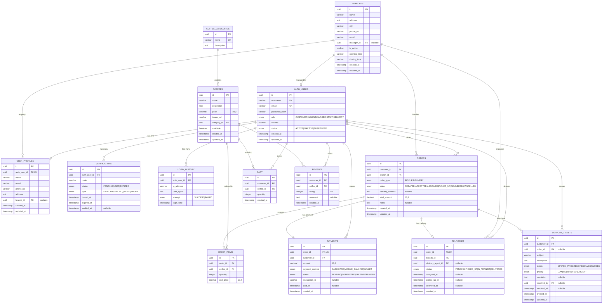

# Coffee Management System - Database Schema

## Entity-Relationship Diagram



## Relational Algebra Operations

### 1. Customer Order Details Query

**Natural Language**: Get all orders with customer info, items, and payment status

**Relational Algebra**:
```
π order_id, customer_name, coffee_name, quantity, total_amount, payment_status (
  ρ O (ORDERS) ⋈
    O.customer_id = U.id
  ρ U (AUTH_USERS ⋈ USER_PROFILES) ⋈
    O.id = OI.order_id
  ρ OI (ORDER_ITEMS) ⋈
    OI.coffee_id = C.id
  ρ C (COFFEES) ⋈
    O.id = P.order_id
  ρ P (PAYMENTS)
)
```

**SQL Equivalent**:
```sql
SELECT
    o.id as order_id,
    up.name as customer_name,
    c.name as coffee_name,
    oi.quantity,
    o.total_amount,
    p.status as payment_status
FROM orders o
INNER JOIN auth_users au ON o.customer_id = au.id
INNER JOIN user_profiles up ON au.id = up.auth_user_id
INNER JOIN order_items oi ON o.id = oi.order_id
INNER JOIN coffees c ON oi.coffee_id = c.id
INNER JOIN payments p ON o.id = p.order_id;
```

### 2. Branch Performance Analytics

**Natural Language**: Calculate total revenue per branch with order count

**Relational Algebra**:
```
π branch_name, total_revenue, order_count (
  γ branch_id, SUM(total_amount) → total_revenue, COUNT(*) → order_count (
    σ status = 'DELIVERED' (ORDERS)
  ) ⋈
    branch_id = id
  BRANCHES
)
```

**SQL Equivalent**:
```sql
SELECT
    b.name as branch_name,
    SUM(o.total_amount) as total_revenue,
    COUNT(*) as order_count
FROM orders o
INNER JOIN branches b ON o.branch_id = b.id
WHERE o.status = 'DELIVERED'
GROUP BY b.id, b.name;
```

### 3. Delivery Agent Performance

**Natural Language**: Find delivery agents with their completed delivery count and average delivery time

**Relational Algebra**:
```
π agent_name, completed_deliveries, avg_delivery_time (
  γ delivery_agent_id,
    COUNT(*) → completed_deliveries,
    AVG(delivered_at - assigned_at) → avg_delivery_time (
    σ status = 'DELIVERED' AND delivery_agent_id IS NOT NULL (DELIVERIES)
  ) ⋈
    delivery_agent_id = auth_user_id
  (AUTH_USERS ⋈ USER_PROFILES)
)
```

**SQL Equivalent**:
```sql
SELECT
    up.name as agent_name,
    COUNT(*) as completed_deliveries,
    AVG(EXTRACT(EPOCH FROM (d.delivered_at - d.assigned_at))/60) as avg_delivery_minutes
FROM deliveries d
INNER JOIN user_profiles up ON d.delivery_agent_id = up.auth_user_id
WHERE d.status = 'DELIVERED'
  AND d.delivery_agent_id IS NOT NULL
GROUP BY up.name;
```

### 4. Coffee Menu with Reviews

**Natural Language**: Get all coffees with their average rating and review count

**Relational Algebra**:
```
π coffee_name, price, category, avg_rating, review_count (
  COFFEES ⋈
    id = category_id
  COFFEE_CATEGORIES ⟕
    id = coffee_id
  γ coffee_id, AVG(rating) → avg_rating, COUNT(*) → review_count (REVIEWS)
)
```

**SQL Equivalent**:
```sql
SELECT
    c.name as coffee_name,
    c.price,
    cc.name as category,
    COALESCE(AVG(r.rating), 0) as avg_rating,
    COUNT(r.id) as review_count
FROM coffees c
INNER JOIN coffee_categories cc ON c.category_id = cc.id
LEFT JOIN reviews r ON c.id = r.coffee_id
GROUP BY c.id, c.name, c.price, cc.name;
```

### 5. Customer Order History with Cart

**Natural Language**: Get customer's order history and current cart items

**Relational Algebra**:
```
π customer_name, order_count, cart_items (
  (USER_PROFILES ⋈ AUTH_USERS) ⟕
    auth_user_id = customer_id
  γ customer_id, COUNT(*) → order_count (ORDERS) ⟕
    customer_id = customer_id
  γ customer_id, COUNT(*) → cart_items (CART)
)
WHERE customer_id = ?
```

**SQL Equivalent**:
```sql
SELECT
    up.name as customer_name,
    COALESCE(COUNT(DISTINCT o.id), 0) as order_count,
    COALESCE(COUNT(DISTINCT c.id), 0) as cart_items
FROM user_profiles up
INNER JOIN auth_users au ON up.auth_user_id = au.id
LEFT JOIN orders o ON au.id = o.customer_id
LEFT JOIN cart c ON au.id = c.customer_id
WHERE au.id = ?
GROUP BY up.name;
```

### 6. Active Orders by Status

**Natural Language**: Get count of orders grouped by status for a specific branch

**Relational Algebra**:
```
π status, order_count (
  γ status, COUNT(*) → order_count (
    σ branch_id = ? AND status IN ('CREATED', 'ACCEPTED', 'ASSIGNED', 'PICKED_UP') (ORDERS)
  )
)
```

**SQL Equivalent**:
```sql
SELECT
    status,
    COUNT(*) as order_count
FROM orders
WHERE branch_id = ?
  AND status IN ('CREATED', 'ACCEPTED', 'ASSIGNED', 'PICKED_UP')
GROUP BY status;
```

### 7. Payment Summary by Method

**Natural Language**: Calculate total amount processed per payment method

**Relational Algebra**:
```
π payment_method, total_amount, transaction_count, success_rate (
  γ payment_method,
    SUM(amount) → total_amount,
    COUNT(*) → transaction_count,
    (COUNT(*) FILTER(status = 'COMPLETED') / COUNT(*)) → success_rate
  (PAYMENTS)
)
```

**SQL Equivalent**:
```sql
SELECT
    payment_method,
    SUM(amount) as total_amount,
    COUNT(*) as transaction_count,
    ROUND(100.0 * COUNT(*) FILTER(WHERE status = 'COMPLETED') / COUNT(*), 2) as success_rate
FROM payments
GROUP BY payment_method;
```

## Database Constraints & Indexes

### Primary Keys
- All tables use `uuid` as primary key for distributed system compatibility
- Generated using `defaultRandom()` in Drizzle ORM

### Foreign Keys with Cascade
```typescript
// ON DELETE CASCADE - prevents orphaned records
authUsers.id → userProfiles.authUserId (CASCADE)
authUsers.id → verifications.authUserId (CASCADE)
authUsers.id → loginHistory.authUserId (CASCADE)
orders.id → orderItems.orderId (CASCADE)
orders.id → payments.orderId (CASCADE)

// ON DELETE SET NULL - preserves historical data
branches.id → userProfiles.branchId (SET NULL)
authUsers.id → deliveries.deliveryAgentId (SET NULL)
```

### Unique Constraints
```typescript
- authUsers.username (UK)
- authUsers.email (UK)
- userProfiles.authUserId (UK)
- coffeeCategories.name (UK)
- payments.orderId (UK) - one payment per order
- deliveries.orderId (UK) - one delivery per order
```

### Indexes (Recommended)
```sql
-- User authentication
CREATE INDEX idx_auth_users_email ON auth_users(email);
CREATE INDEX idx_auth_users_username ON auth_users(username);

-- Orders performance
CREATE INDEX idx_orders_customer ON orders(customer_id);
CREATE INDEX idx_orders_branch ON orders(branch_id);
CREATE INDEX idx_orders_status ON orders(status);
CREATE INDEX idx_orders_created_at ON orders(created_at DESC);

-- Deliveries
CREATE INDEX idx_deliveries_agent ON deliveries(delivery_agent_id);
CREATE INDEX idx_deliveries_status ON deliveries(status);

-- Cart
CREATE INDEX idx_cart_customer ON cart(customer_id);

-- Payments
CREATE INDEX idx_payments_customer ON payments(customer_id);
CREATE INDEX idx_payments_status ON payments(status);

-- Reviews
CREATE INDEX idx_reviews_coffee ON reviews(coffee_id);
CREATE INDEX idx_reviews_customer ON reviews(customer_id);
```

## Normalization Analysis

### Current Normalization Level: **3NF (Third Normal Form)**

#### 1NF (First Normal Form) ✅
- All attributes contain atomic values
- No repeating groups
- Each table has a primary key

#### 2NF (Second Normal Form) ✅
- All non-key attributes depend on entire primary key
- No partial dependencies
- Junction tables properly normalized (ORDER_ITEMS, CART)

#### 3NF (Third Normal Form) ✅
- No transitive dependencies
- Separated categories from coffees
- Separated auth data from profile data
- Branch information separate from orders

#### Design Decisions:
1. **AUTH_USERS vs USER_PROFILES**: Authentication data separated from profile data for security and flexibility
2. **COFFEE_CATEGORIES**: Normalized to prevent redundancy and allow easy category management
3. **ORDER_ITEMS**: Junction table for many-to-many relationship between orders and coffees
4. **Denormalization**: `total_amount` in ORDERS is denormalized for performance (calculated from ORDER_ITEMS)

## Transaction Boundaries

### Critical Operations Requiring Transactions:
1. **Order Creation**: Insert into ORDERS, ORDER_ITEMS, PAYMENTS, DELIVERIES (if delivery order), DELETE from CART
2. **Payment Processing**: Update PAYMENTS.status, Update ORDERS.status
3. **User Registration**: Insert into AUTH_USERS, USER_PROFILES, VERIFICATIONS
4. **Order Cancellation**: Update ORDERS.status, Update PAYMENTS.status (refund), Update DELIVERIES.status
