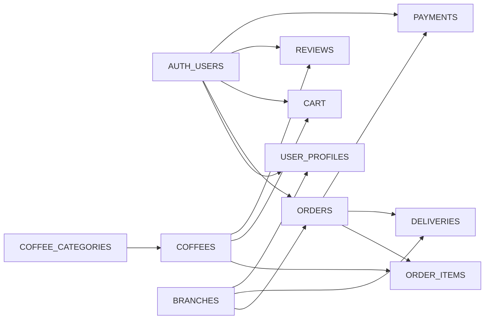
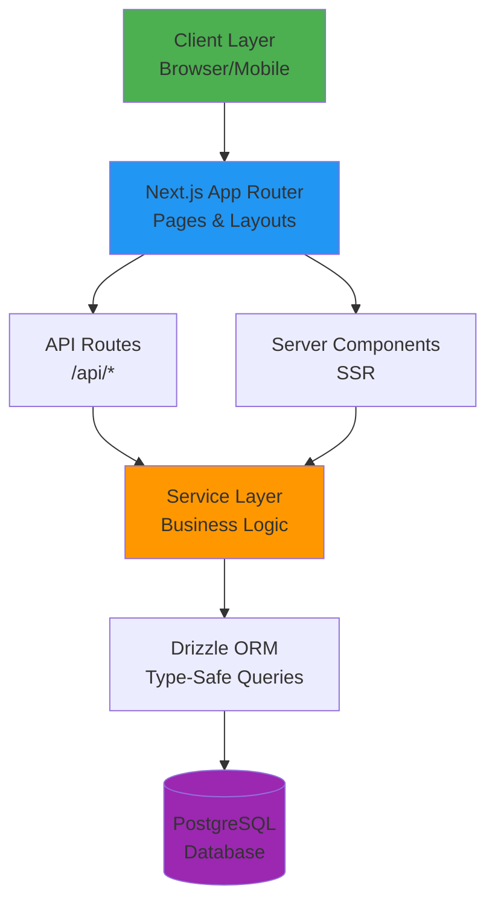
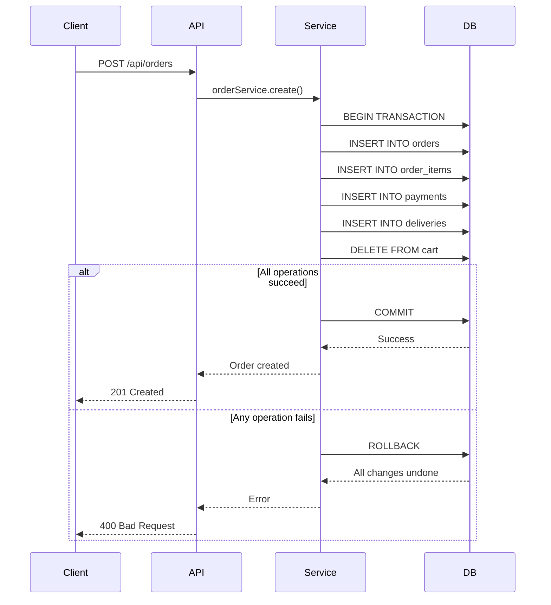
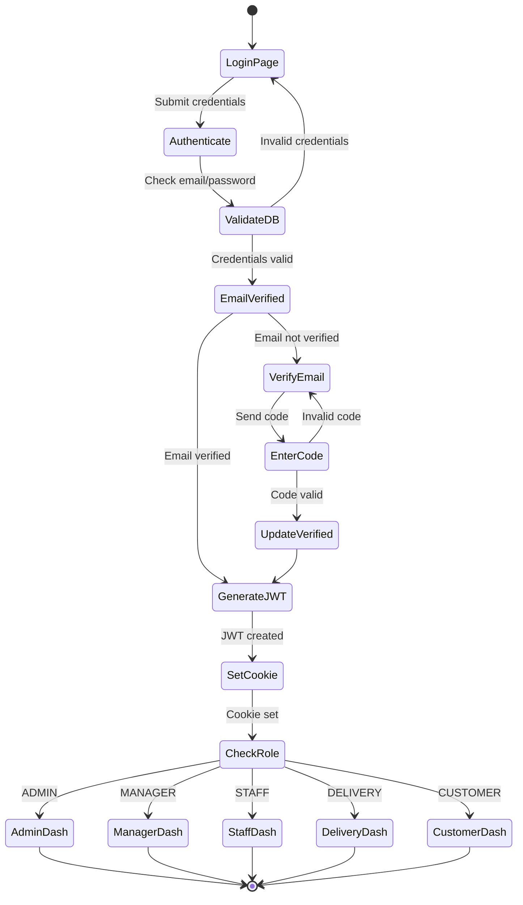
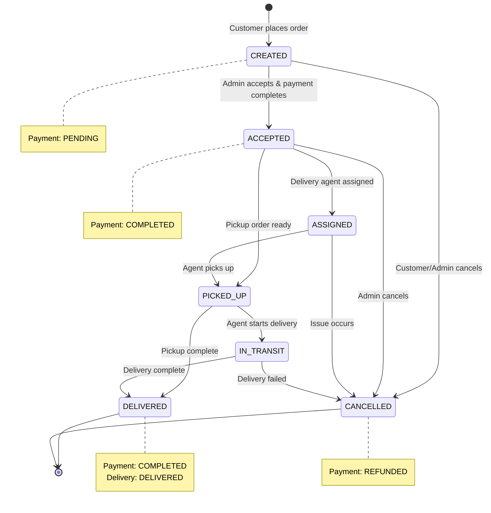
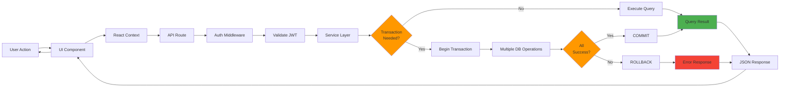
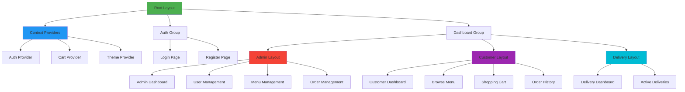
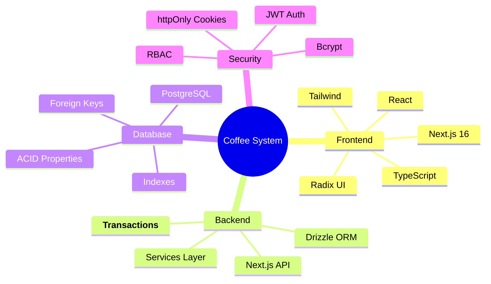

# Coffee Management System - Diagrams Quick Reference

This file contains all visual diagrams for the system. Use Mermaid Live Editor to view: https://mermaid.live

## 📊 Database Entity-Relationship Diagram

Full ERD with all relationships → See [DATABASE_SCHEMA.md](./DATABASE_SCHEMA.md)

**Quick Overview:**


## 🏗️ Application Architecture

Full architecture → See [ARCHITECTURE.md](./ARCHITECTURE.md)

**Layered Architecture:**


## 🔄 Transaction Flow

Full transaction docs → See [TRANSACTIONS.md](./TRANSACTIONS.md)

**Order Creation Transaction:**


## 🔐 Authentication Flow

**Complete Auth Flow:**


## 📦 Order State Machine

**Order Status Transitions:**


## 🚀 Data Flow

**Request → Response Flow:**


## 🗂️ Folder Structure

```
coffee-management-system/
│
├── app/                          # Next.js App Router
│   ├── (auth)/                  # Auth routes group
│   │   ├── login/
│   │   └── register/
│   ├── (dashboard)/             # Dashboard routes group
│   │   ├── admin/               # Admin panel
│   │   │   ├── users/
│   │   │   ├── menu/
│   │   │   ├── orders/
│   │   │   ├── payments/
│   │   │   └── deliveries/
│   │   ├── customer/            # Customer panel
│   │   │   ├── menu/
│   │   │   ├── cart/
│   │   │   └── orders/
│   │   └── delivery/            # Delivery panel
│   └── api/                     # API routes
│       ├── auth/
│       ├── coffees/
│       ├── orders/
│       ├── payments/
│       └── deliveries/
│
├── src/
│   ├── backend/
│   │   ├── database/
│   │   │   ├── schema/          # 📊 Database schemas
│   │   │   │   ├── auth.schema.ts
│   │   │   │   ├── order.schema.ts
│   │   │   │   ├── coffee.schema.ts
│   │   │   │   └── ...
│   │   │   ├── client.ts        # 🔌 DB connection
│   │   │   ├── enums.ts         # 🏷️ Enum definitions
│   │   │   └── seed.ts          # 🌱 Seed script
│   │   └── services/            # 💼 Business logic
│   │       ├── auth.service.ts
│   │       ├── order.service.ts      # ⚡ WITH TRANSACTIONS
│   │       ├── payment.service.ts    # ⚡ WITH TRANSACTIONS
│   │       └── ...
│   │
│   ├── components/ui/           # 🎨 Reusable UI components
│   ├── contexts/                # 🔄 React contexts
│   ├── lib/                     # 🛠️ Utilities
│   └── types/                   # 📝 TypeScript types
│
└── docs/                        # 📚 Documentation
    ├── DATABASE_SCHEMA.md       # ERD & Relational Algebra
    ├── ARCHITECTURE.md          # System Architecture
    ├── TRANSACTIONS.md          # Transaction Guide
    └── DIAGRAMS_REFERENCE.md    # This file
```

## 🔍 Key Relational Algebra Examples

Full algebra → See [DATABASE_SCHEMA.md](./DATABASE_SCHEMA.md#relational-algebra-operations)

**1. Customer Orders with Items:**
```
π order_id, customer_name, coffee_name, total_amount (
  ORDERS ⋈ AUTH_USERS ⋈ ORDER_ITEMS ⋈ COFFEES
)
```

**2. Branch Revenue:**
```
π branch_name, SUM(total_amount) (
  σ status='DELIVERED' (ORDERS) ⋈ BRANCHES
)
```

**3. Coffee Ratings:**
```
π coffee_name, AVG(rating) (
  COFFEES ⟕ REVIEWS
)
```

## 📱 Component Hierarchy



## 🔧 Tech Stack Overview



## 📊 Database Tables Summary

| Table | Purpose | Key Relations | Transactions |
|-------|---------|---------------|--------------|
| `auth_users` | Authentication | → user_profiles, orders, cart | Registration |
| `user_profiles` | User details | ← auth_users, → branches | Registration |
| `orders` | Order records | → order_items, payments, deliveries | Creation, Cancellation |
| `order_items` | Order contents | ← orders, → coffees | Order Creation |
| `payments` | Payments | ← orders | Processing, Refund |
| `deliveries` | Deliveries | ← orders, → auth_users (agent) | Assignment |
| `coffees` | Menu items | → order_items, cart, reviews | - |
| `cart` | Shopping cart | ← auth_users, → coffees | Order Creation |
| `branches` | Coffee shops | → orders, deliveries, staff | - |
| `reviews` | Coffee reviews | ← auth_users, → coffees | - |

## 🎯 Transaction Summary

| Operation | Service | Method | Tables Affected | Why Transaction |
|-----------|---------|--------|-----------------|-----------------|
| Order Creation | orderService | create() | orders, order_items, payments, deliveries, cart | 5 tables must be consistent |
| Payment Processing | paymentService | processPayment() | payments, orders | Payment + order status sync |
| User Registration | authService | register() | auth_users, user_profiles, verifications | Complete user account |
| Order Cancellation | orderService | cancelOrder() | orders, deliveries, payments | Status + refund sync |
| Agent Assignment | orderService | assignDeliveryAgent() | deliveries, orders | Assignment + status sync |

---

**For detailed information, see:**
- [DATABASE_SCHEMA.md](./DATABASE_SCHEMA.md) - Complete ERD and relational algebra
- [ARCHITECTURE.md](./ARCHITECTURE.md) - System architecture and design
- [TRANSACTIONS.md](./TRANSACTIONS.md) - Transaction implementation guide

**View Mermaid Diagrams:** https://mermaid.live
